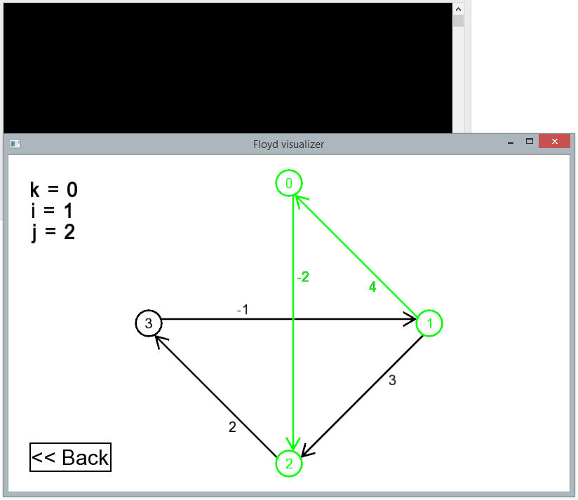

Floyd-Warshall algorithm visualization on C++ using [SFML](https://www.sfml-dev.org/).

Just a piece of code visualising Floyd-Warshall algorithm of a graph you give to it. The look is customizable by tuning defines of FloydVisualizer.cpp. You can compile it using Visual Studio 2015 or 2017. You must have SFML library installed to build it. Project settings expect it in `C:\sfml vs\`, you can change the path to yours using tutorials on SFML site.

This project was never intended to be something long-lasting or evolving, think of it as a "written-and-forgotten" app. Most probably I won't change anything here ever.

